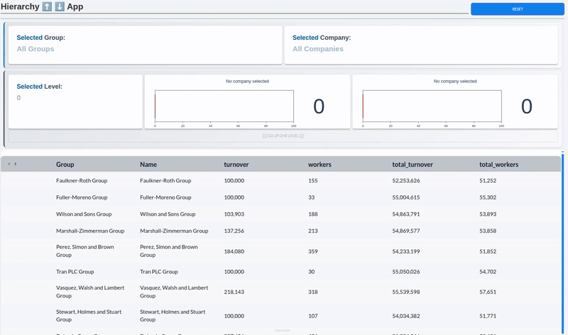
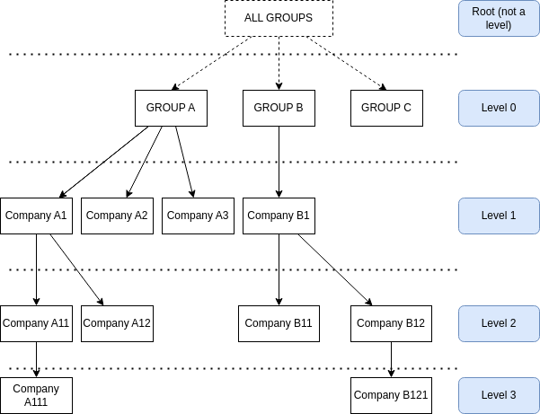

# Hierarchy App

A Taipy app displaying hierarchical data.

This app's goal is to show how to navigate in a hierachy using a `table` element within a Taipy app.  
I added some KPI indicators and I styled to make it look more realistic, but t the key focus is on the aggregation of tree branches and how the app allows users to explore deeper levels by clicking on rows and move back up the hierarchy.

## Hierearchical Data

This application is based on a True enterprise story!

What I mean by hierarchy is a non-binary tree (or just a tree). A tree is a special graph with a single root node that connects to `n` child nodes. Each of these child nodes can, in turn, have their own children, forming branches of the tree. Every node (except the root) has exactly one parent. Nodes with no children are "leaves".

The following diagram shows an example of tree structure:

The enterprise problem that inspired this app consisted in creating a way to inspect a total amount of contracts grouped by branches (groups of companies) within big companies. It turns out that big corporations are conglomerates of companies, that own companies, which themselves own companies... Our original problem had a maximal depth of 9 companies, this application has a max depth of 6 (six levels).

The notebook in `src/create_dataset/create_dataset.ipynb` creates a demonstration dataset using `faker`.

To represent hierearchical data in a 2-Dimensional manner, you can create one row for each node (each company in this case), and add a colum to reference the parent (In the dataset, the column is `parent_id`). This is a [well-known modelling technique](https://en.wikipedia.org/wiki/Hierarchical_database_model), and it's the one used in the original problem.

## Why Use Taipy?

The original solution to this problem uses Excel, and [this awesome and clever technique by Alberto Ferrari](https://www.sqlbi.com/articles/clever-hierarchy-handling-in-dax/).

At the time, the department where I worked didn't have access to Taipy nor any other application builder. We also didn't have access to Power BI. These are the benefits of using an app over an Excel solution (and even over Power BI):

* It allows full automation of the process, it's difficult to industrialize Excel sheet generation
* You get to use Python over a mix of Python, DAX and PowerQuery. I mention Python because your enterprise data will likely need pre-processing (ours sure did!). If you use Taipy, you preprocess your data with Python, create a table (in a database or a file) and use a Python (Taipy) app to display your data
* You get the flexibility of having a custom app (create custom functions or use CSS to style your app)

## Favicon

This app uses a favicon from [favicon.io](https://favicon.io/), check them out, it's a great site if you need quick emoji-based icons!
